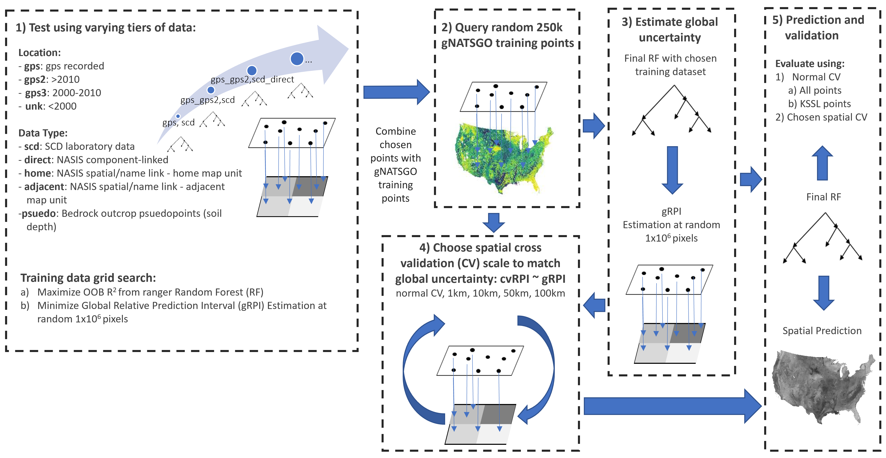

<!-- README.md is generated from README.Rmd. Please edit that file -->

# DSMprops: Digital Soil Mapping of numeric properties

<!-- badges: start -->

<!-- badges: end -->

A hybrid repository including an R package for commonly used functions
and project executable scripts (exec folder) documenting current
workflows for project implementation of digital soil mapping (DSM) models in the Soil Landscapes
of the United States 100m product (SOLUS100).

 and gNATSGO (b) maps of clay content at 5 cm with associated SOLUS sample density (c), upper (d) and lower (e) 95% prediction intervals (PIs) and relative prediction interval (RPI, f).")
SOLUS (a) and gNATSGO (b) maps of clay content at 5 cm with associated SOLUS sample density (c), upper (d) and lower (e) 95% prediction intervals (PIs) and relative prediction interval (RPI, f).
## Installation

You can install the released version of DSMprops from GitHub for R
functions with:

``` r
install.packages("remotes")
remotes::install_github("naumi421/DSMprops")
```

To get both R package functionality and access to all exec workflows,
you can clone this repository locally and then build R package. Although
you can just clone the repository to get all the code and be able to
build the package, devtools is needed to contribute to the repository.
Note that [Rtools](https://cran.r-project.org/bin/windows/Rtools/)
(windows) or other pre-requisites (e.g.
[Ubuntu](https://www.digitalocean.com/community/tutorials/how-to-install-r-packages-using-devtools-on-ubuntu-18-04))
are necessary for installing devtools.

Cloning in bash:

``` bash
$ cd /path/where/repo/goes
$ git clone https://github.com/naumi421/DSMprops.git #(or alternate repo URL)
```

Rstudio also has options for cloning a repo with good guidance available
at <https://happygitwithr.com/>.

Once repository has been cloned. Open the R project in Rstudio and use
*Build \> Install and Restart* to install DSMprops package which can
then be used in other sessions outside of the project.

# Summary

This repository documents specific steps used to create the SOLUS100 dataset. The focus of the SOLUS100m development team
was to better utilize various parts of the National Cooperative Soil Survey (NCSS) datasets to inform digital soil mapping of useful
soil properties. Data from the Kellog Soil Survey Laboratory National Soil Characterization Database (SCD), field classified pedons
from the NCSS program, and gNATSGO were all utilized in a hybrid training set to increase model inference. This increases sample size by 
~10-15x relative to other efforts to predict soil properties across the conterminous United States (CONUS).

Please see the associated publication for further details on methods and performance of models:

Nauman, T.W., Kienast-Brown, S, White, D., Brungard, C, Roecker, S, Philippe, J., Thompson, J.A. Soil Landscapes of the United States (SOLUS): developing predictive soil property maps of the conterminous US using hybrid training sets.
In Preparation for submission to Soil Science Society of America Journal.

## Properties included in SOLUS100 dataset
Twenty differnt soil properties were mapped for SOLUS100. All properties were defined consistently with U.S. Soil Survey Geographic Database (SSURGO)
standards. These properties are listed in the table below, but more detailed descriptions can be found in SSURGO documentation.

| Property                 |SSURGO code | Units       | Notes                                            |
| ------------------------ | ---------- | ----------- | ------------------------------------------------ |
| Clay                     |claytotal   | % mass      |                                                  |
| Silt                     |silttotal   | % mass      |                                                  |
| Sand                     |sandtotal   | % mass      |                                                  |
| Very fine sand           |sandvf      | % mass      |                                                  |
| Fine sand                |sandfine    | % mass      |                                                  |
| Medium sand              |sandmed     | % mass      |                                                  |
| Coarse sand              |sandco      | % mass      |                                                  |
| Very coarse sand         |sandvc      | % mass      |                                                  |
| Depth to bedrock         |anylithicdpt*| cm         | Depth to lithic of paralithic contact            |
| Depth to restriction     |resdept     | cm          | Depth to layer that limits air, water, or roots  |
| pH                       |ph1to1h2o   | -log[H+]    | 1:1 method                                       |
| Rock fragments           |fragvol     | % vol.      | Particles >2mm, whole soil basis                 |
| Bulk Density             |dbovendry   | g cm<sup>-3</sup> | Oven dry bulk density                      |
| Calcium carbonate        |caco3       | % mass      |                                                  |
| Gypsum                   |gypsum      | % mass      |                                                  |
| CEC at pH7               |cec7        | meq / 100g  | Cation Exchange Capacity (CEC) <2mm fraction     |
| ECEC                     |ecec        | meq / 100g  | Effective CEC                                    |
| Soil organic carbon      |soc         | % mass      |                                                  |
| Sodium Adsorption Ratio  |sar         | unitless    | Ratio of [Na]/([Ca]+[Mg]) in Saturated Paste     |
| Electrical conductivity  |ec          | dS / m      | Saturated paste                                  |

*New theme created from specified lithic or paralithic restrictions to estimate bedrock depth. 

# General Workflow for SOLUS100

SOLUS100 process workflow for selecting training data, model building, and model performance assessment.

SOLUS100 combines several different types of training data to increaase model inference. A selection process was used to ensure that inclusion of new tiers of data did not degrade model quality. 
This included both incrementally adding different types and ages of data. Both source of data and uncertainty of geolocation information were assessed in a data grid test of adding progressively 
more data to models starting with the highest quality and incrementally adding data with more and more uncertainty. Both out-of-bag R<sup>2</sup> and a global uncertainty summery (mean relative prediction interval) 
were used to rank models with various combinations of training data to select the optimal tiers of training data. Random forest models were fit for every property at every depth in this fashion.
Models were created for point depths (as opposed to interval) at 0, 5, 15, 30, 60, 100, and 150 cm excepting soil depth to restriction and bedrock.

# Structure of DSMprops repository
This repository is structured to include both an R package ([R](R/) and [man](man/) folders) and workflow documentation ([exec folder](exec/)). The R package portion includes common functions used extensively in workflows and includes cross-validation, spatial cross-validation, 
weighting schemes, global uncertainty estimation, point extraction of raster values, and validation statistical summaries. 

<!-- create url links to each part when repo location is finalized -->

## A. Pedon dataset cleaning and prep \[per property?\]

### A.1 Forest Service NRM data \[Colby\]

### A.2 NASIS point data

### A.3 KSSL data

### A.4 RaCA

### A.5 Other point data

## B. Depth Harmonization

### (0-5, 5-15, 15-30, 30-60, 60-100, 100-200 cm) \[per property\]

## C. Build Training Matrix

### C.1 Extract DEM derivatives

### C.2 Extract spectral derivatives

### C.3 Extract other geospatial covariates

## D. Build Models \[per property\]

### D.1 Build list to hold each regional model per property \[big point of discussion here\]

### D.2 Set up training routine (cross validation repeated 10 times or something).

### D.3 Training/evaluation data split

### D.4 Build continental model

### D.5 Build regional models

## E. Model Evaluation

### E.1 Evalute continental model

### E.2 Evaulate each regional model

### E.3 Covariate importance

## F. Spatial Predictions \[how to use regional models?\]

## G. Spatial Uncertainty

## H. Locations where the addition of legacy or new sample data would prove most beneficial to model improvement and/or uncertainty reduction.
